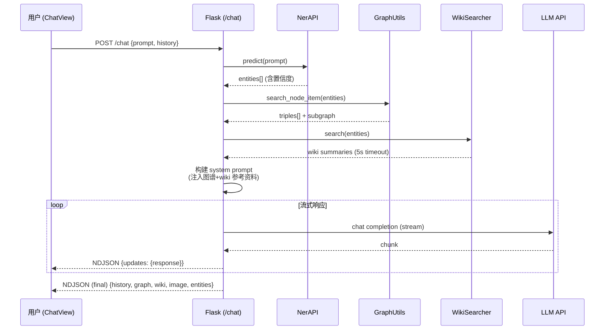
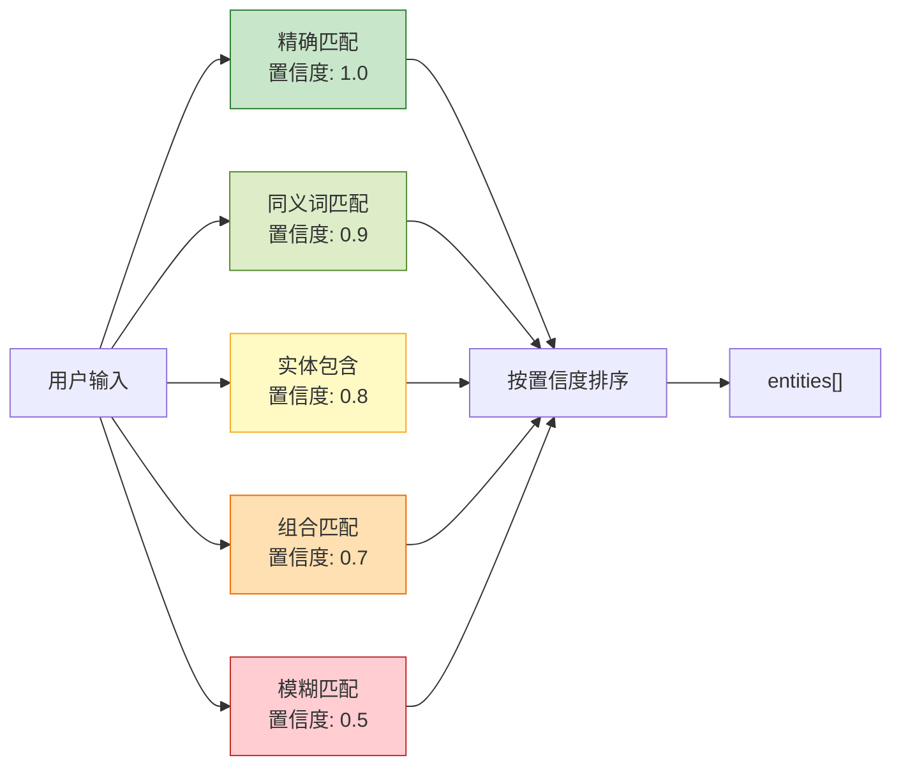
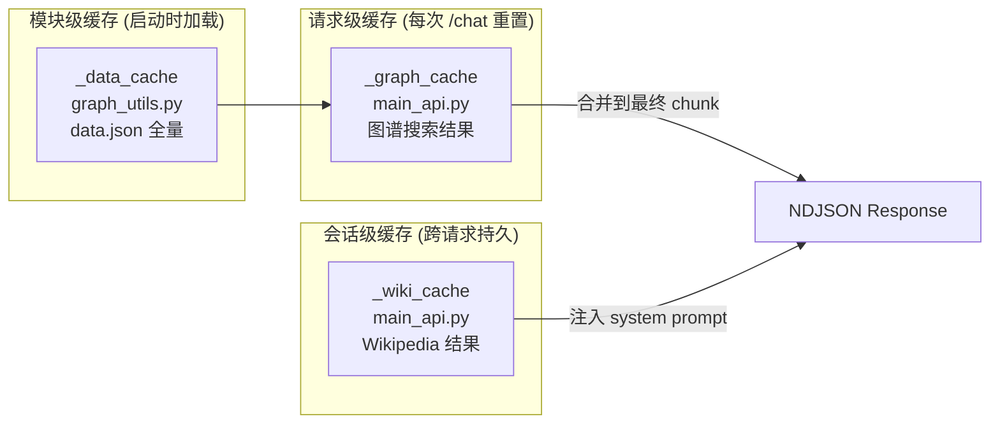
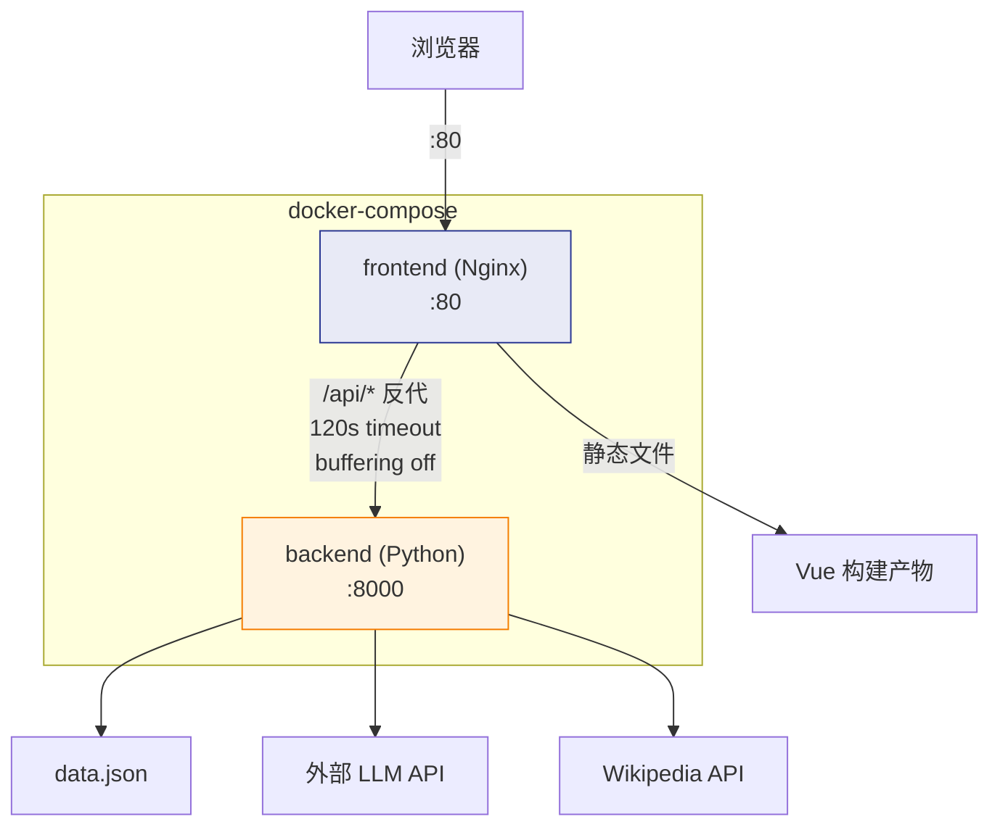

# ChatKG 架构图

## 整体架构

```mermaid
graph TB
    subgraph Frontend["前端 (Vue 3 + Vite, :5173)"]
        Router["Vue Router"]
        HomeView["HomeView"]
        ChatView["ChatView"]
        GraphView["GraphView"]
        AboutView["AboutView"]

        subgraph ChatComponents["Chat 组件"]
            MessageList["MessageList"]
            MessageInput["MessageInput"]
            InfoPanel["InfoPanel"]
            KnowledgeGraph["KnowledgeGraph"]
        end

        ChatView --> MessageList
        ChatView --> MessageInput
        ChatView --> InfoPanel
        InfoPanel --> KnowledgeGraph
    end

    subgraph Backend["后端 (Flask, :8000)"]
        MainAPI["main_api.py<br/>Flask 路由"]

        subgraph Utils["工具层"]
            NER["ner_api.py<br/>NerAPI 单例"]
            GraphUtils["graph_utils.py<br/>图谱检索"]
            Wiki["query_wiki.py<br/>Wikipedia 搜索"]
            ImageSearcher["image_searcher.py<br/>图片搜索"]
        end

        MainAPI --> NER
        MainAPI --> GraphUtils
        MainAPI --> Wiki
        MainAPI --> ImageSearcher
    end

    subgraph Data["数据层"]
        DataJSON["server/data/data.json<br/>知识图谱 (69K 行)"]
        SynonymsJSON["server/data/synonyms.json<br/>同义词典"]
        Config["config/settings.py<br/>Settings 单例"]
        Schema["data/schema/schema_v4.py<br/>13 实体类型"]
    end

    subgraph External["外部服务"]
        LLM["OpenAI 兼容 API<br/>(MiMo / ChatGLM)"]
        Wikipedia["中文 Wikipedia API"]
    end

    subgraph KGPipeline["KG 构建流程 (main.py)"]
        UIE["UIE 实体抽取"]
        BERT["BERT 过滤"]
        Refine["精炼"]
        SPN4RE["SPN4RE 关系抽取"]
        Iteration["迭代扩展"]
        UIE --> BERT --> Refine --> SPN4RE --> Iteration
    end

    %% 前端 -> 后端
    ChatView -->|"/api/chat (NDJSON 流)"| MainAPI
    GraphView -->|"/api/graph"| MainAPI
    GraphView -->|"/api/entity/:name"| MainAPI

    %% 后端 -> 数据
    NER --> DataJSON
    NER --> SynonymsJSON
    GraphUtils --> DataJSON
    Config --> Schema

    %% 后端 -> 外部
    MainAPI -->|streaming| LLM
    Wiki --> Wikipedia

    %% KG 构建 -> 数据
    KGPipeline -.->|"输出"| DataJSON

    style Frontend fill:#e1f5fe,stroke:#0288d1
    style Backend fill:#fff3e0,stroke:#f57c00
    style Data fill:#e8f5e9,stroke:#388e3c
    style External fill:#fce4ec,stroke:#c62828
    style KGPipeline fill:#f3e5f5,stroke:#7b1fa2
```

## Chat 请求数据流

```mermaid
sequenceDiagram
    participant U as 用户 (ChatView)
    participant F as Flask (/chat)
    participant N as NerAPI
    participant G as GraphUtils
    participant W as WikiSearcher
    participant L as LLM API

    U->>F: POST /chat {prompt, history}
    F->>N: predict(prompt)
    N-->>F: entities[] (含置信度)
    F->>G: search_node_item(entities)
    G-->>F: triples[] + subgraph
    F->>W: search(entities)
    W-->>F: wiki summaries (5s timeout)

    F->>F: 构建 system prompt<br/>(注入图谱+wiki 参考资料)

    loop 流式响应
        F->>L: chat completion (stream)
        L-->>F: chunk
        F-->>U: NDJSON {updates: {response}}
    end

    F-->>U: NDJSON (final) {history, graph, wiki, image, entities}
```

## NER 置信度分层

```mermaid
graph LR
    Input["用户输入"] --> Exact["精确匹配<br/>置信度: 1.0"]
    Input --> Synonym["同义词匹配<br/>置信度: 0.9"]
    Input --> Substring["实体包含<br/>置信度: 0.8"]
    Input --> Combo["组合匹配<br/>置信度: 0.7"]
    Input --> Fuzzy["模糊匹配<br/>置信度: 0.5"]

    Exact --> Sort["按置信度排序"]
    Synonym --> Sort
    Substring --> Sort
    Combo --> Sort
    Fuzzy --> Sort

    Sort --> Output["entities[]"]

    style Exact fill:#c8e6c9,stroke:#2e7d32
    style Synonym fill:#dcedc8,stroke:#558b2f
    style Substring fill:#fff9c4,stroke:#f9a825
    style Combo fill:#ffe0b2,stroke:#ef6c00
    style Fuzzy fill:#ffcdd2,stroke:#c62828
```

## 缓存架构

```mermaid
graph LR
    subgraph ModuleLevel["模块级缓存 (启动时加载)"]
        DataCache["_data_cache<br/>graph_utils.py<br/>data.json 全量"]
    end

    subgraph RequestLevel["请求级缓存 (每次 /chat 重置)"]
        GraphCache["_graph_cache<br/>main_api.py<br/>图谱搜索结果"]
    end

    subgraph SessionLevel["会话级缓存 (跨请求持久)"]
        WikiCache["_wiki_cache<br/>main_api.py<br/>Wikipedia 结果"]
    end

    DataCache --> GraphCache
    GraphCache -->|"合并到最终 chunk"| Response["NDJSON Response"]
    WikiCache -->|"注入 system prompt"| Response
```

## Docker 部署架构

```mermaid
graph TB
    Browser["浏览器"] -->|":80"| Nginx

    subgraph DockerCompose["docker-compose"]
        Nginx["frontend (Nginx)<br/>:80"]
        Backend["backend (Python)<br/>:8000"]
    end

    Nginx -->|"/api/* 反代<br/>120s timeout<br/>buffering off"| Backend
    Nginx -->|"静态文件"| VueDist["Vue 构建产物"]

    Backend --> DataJSON["data.json"]
    Backend --> LLM["外部 LLM API"]
    Backend --> Wiki["Wikipedia API"]

    style Nginx fill:#e8eaf6,stroke:#283593
    style Backend fill:#fff3e0,stroke:#f57c00
```
